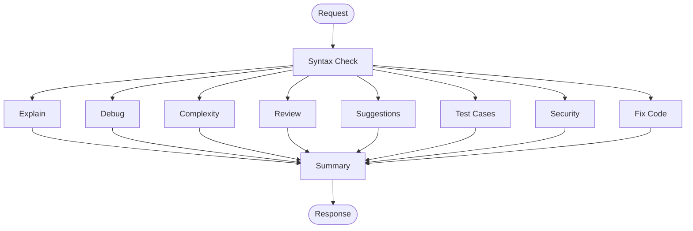

# AI Code Mentor

An AI-powered code analysis platform that helps developers understand, debug, review, and improve their code. Paste code into a Monaco editor, run a single analysis, and get structured feedback across explanation, bugs, complexity, security, test cases, and more.

**Live demo:** [ai-code-helper-kappa.vercel.app](https://ai-code-helper-kappa.vercel.app)

---

## Features

| Capability | Description |
|---|---|
| **Syntax checking** | Validates Python syntax using AST parsing before deeper analysis |
| **Code explanation** | Breaks down purpose, flow, and key logic |
| **Bug detection** | Surfaces logical errors, edge cases, and runtime issues |
| **Complexity analysis** | Estimates time and space complexity with reasoning |
| **Code review** | Scores readability, maintainability, and performance (out of 10) |
| **Suggestions** | Recommends readability, performance, and best-practice improvements |
| **Test case generation** | Produces normal, edge, and stress test cases |
| **Security review** | Checks for SQL injection, XSS, command injection, hardcoded secrets, and unsafe file ops |
| **Code fixing** | Returns issues found, a fixed version, and an explanation |
| **Summary report** | Aggregates all analysis results into one final report |

---

## Architecture

The backend uses a **LangGraph** pipeline: syntax is checked first, then multiple AI-powered analysis nodes run in parallel, and a summary node merges everything before returning the response.



The frontend is a **Next.js** app with a split-panel layout: Monaco code editor on the left, tabbed results on the right.

---

## Tech Stack

### Backend (`app/`)
- **FastAPI** — REST API with CORS for the frontend
- **LangGraph** — orchestrates the multi-step analysis pipeline
- **LangChain + OpenRouter** — LLM calls via DeepSeek Chat (`deepseek/deepseek-chat-v3-0324`)
- **Python AST** — static syntax validation

### Frontend (`frontend/`)
- **Next.js 16** + **React 19**
- **Monaco Editor** — in-browser code editing
- **Tailwind CSS 4** — dark-themed UI
- **React Markdown** — renders analysis output

---

## Project Structure

```
ai_coder/
├── app/                          # Python backend
│   ├── main.py                   # FastAPI app & /analyze endpoint
│   ├── graph.py                  # LangGraph pipeline definition
│   ├── state.py                  # Shared graph state schema
│   ├── llm.py                    # OpenRouter LLM client
│   ├── nodes/                    # Individual analysis steps
│   │   ├── syntax.py             # AST syntax check
│   │   ├── explain.py            # Code explanation
│   │   ├── debug.py              # Bug detection
│   │   ├── complexity.py         # Complexity analysis
│   │   ├── review.py             # Code review scores
│   │   ├── suggestions.py        # Improvement suggestions
│   │   ├── testcases.py          # Test case generation
│   │   ├── security.py           # Security review
│   │   ├── fix_code.py           # Code fixing
│   │   └── summary.py            # Final report aggregation
│   └── test_graph.py             # Sample graph invocation script
│
└── frontend/                     # Next.js frontend
    └── src/
        ├── app/page.tsx          # Main UI
        ├── components/           # Editor, tabs, results panel
        ├── lib/api.ts            # Backend API client
        └── types/analysis.ts     # Response type definitions
```

---

## Getting Started

### Prerequisites

- **Python 3.11+**
- **Node.js 18+**
- An [OpenRouter](https://openrouter.ai/) API key

### 1. Backend setup

```bash
cd app

# Create and activate a virtual environment
python -m venv venv
# Windows
venv\Scripts\activate
# macOS / Linux
source venv/bin/activate

# Install dependencies
pip install fastapi uvicorn langgraph langchain-openai python-dotenv pydantic

# Configure environment
echo OPENROUTER_API_KEY=your_key_here > .env

# Run the API server
uvicorn main:app --reload --port 8000
```

The API will be available at `http://localhost:8000`.

### 2. Frontend setup

```bash
cd frontend

npm install

# Optional: point to local backend instead of the deployed API
# Edit src/lib/api.ts and change the fetch URL to http://localhost:8000/analyze

npm run dev
```

Open [http://localhost:3000](http://localhost:3000) in your browser.

---

## Environment Variables

| Variable | Location | Description |
|---|---|---|
| `OPENROUTER_API_KEY` | `app/.env` | API key for OpenRouter (required for LLM analysis) |

---

## API Reference

### `GET /`

Health check.

**Response:**
```json
{ "message": "AI Code Mentor Running" }
```

### `POST /analyze`

Analyze a code snippet.

**Request body:**
```json
{
  "code": "def hello():\n    print('Hello, world!')"
}
```

**Response:**
```json
{
  "code": "...",
  "syntax_result": "No syntax errors found.",
  "explanation": "...",
  "bugs": "...",
  "complexity": "...",
  "review": "...",
  "suggestions": "...",
  "test_cases": "...",
  "security_review": "...",
  "fixed_code": "...",
  "summary": "..."
}
```

---

## Deployment

| Service | Platform | URL |
|---|---|---|
| Frontend | Vercel | [ai-code-helper-kappa.vercel.app](https://ai-code-helper-kappa.vercel.app) |
| Backend | Render | `https://ai-code-helper-rl6w.onrender.com` |

The backend CORS policy allows requests from `http://localhost:3000` and the Vercel frontend URL.

---

## Development Notes

- **Syntax checking** currently uses Python's `ast` module, so it is optimized for Python code. Other languages can still be analyzed by the LLM nodes, but will not pass through static syntax validation.
- **`language` node** is registered in the graph but not wired into the pipeline yet.
- **`static_complexity.py`** and **`recursion_detector.py`** are utility modules available for future static analysis enhancements.

### Quick backend test

```bash
cd app
python test_graph.py
```

This runs the graph against a sample recursive factorial snippet and prints the summary.

---

## License

This project is open source. Add a license file if you plan to distribute it.
